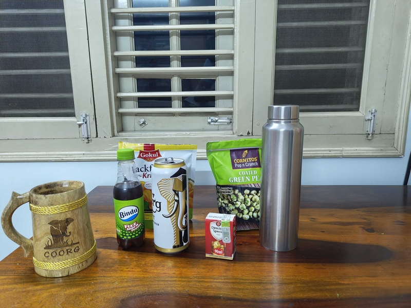
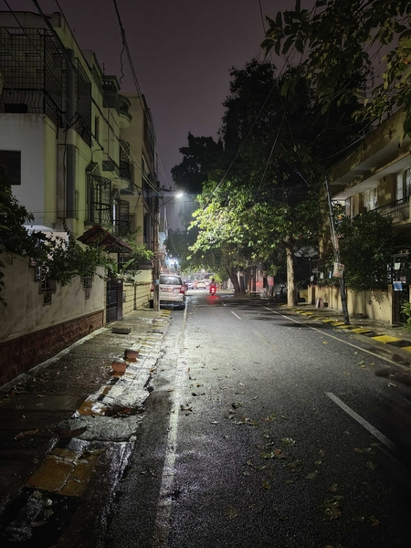

17/04/2025

Today, we will do a tasting of [Fizzy Bubblech](https://www.youtube.com/watch?v=laKOJ9c25Do), Beer, Whiskey, Water  

**Cheers!**

In image, left -> right, presenting:  
Bindu Jeera (fizzy drink)  
Vacuum fried Jackfruit chips  
Carlsberg Elephant beer  
Director's Special Whiskey (BTW in Bangalore you get whiskey also in tetrapacks)  
Wasabi coated greenpeas  
Water bottle  

##

What do we do as we consume things? How are these things related? I believe that, **You are what You consume.**  
## 
A perspective on this, is, How much time was spent by the entities as themselves before they reached you finally for consumption. In other words when was it ready? Or when is a good day to claim as such?  
Typically a **soft drink** takes around 5 mins to prepare in a factory at scale.  
**Beer** takes around a around a month or two.  
**Whiskey**, 2-3 years minimum  

**What about water?**   

[~4 billion years](https://en.wikipedia.org/wiki/Origin_of_water_on_Earth#History_of_water_on_Earth) (1 billion = 1,000,000,000)  
As mortals we have a beginning and an end, we call the time in between life.
You could use the same definition for what we consume or interact with also. Technically we are all as old as [Big Bang](https://en.wikipedia.org/wiki/Big_Bang) (~13.7 billion years). Typically a human lives to [75 years](https://en.wikipedia.org/wiki/Life_expectancy).  

This here vis-a-vis is my issue regarding the loss of language or inability to have a conversation, which I mention in the [intro](https://vishaksagar.github.io/DVS/#file=README.md) as **some of my observations on life, are beyond what I can share with those whom I know.**

##
Another perspective is how we navigate exchanging the experience of taste.  
Distilled water is tasteless, or so we were taught in school. Do we know this or is this by definition? For example: we colloquially say, the sun rises in the East. True. Unfortunately, East is by definition the direction the sun rises in. This is cyclic or a [tautology](https://en.wikipedia.org/wiki/Tautology_(logic)).  
If so, then what is the experiece of taste but a relative measure to tasteless?  
**Sugar water** is sweet and fizzy.  
The first time I had **beer**, I described it as Donkey piss with cumin (some promotional event was happening at BBQ nation and a senior of mine had taken me during college 🫡)  
If you are used good **whiskey**, you'd not be able to drink what's in the tetrapack. 

**What about water?**

    To have this conversation, you'd need to be able to drink, at least water, then we have somewhere to start.

  

Here's a pic of me driving home in rain, yesterday.  

    Can you imagine what it tastes like?

-The Silent Librarian

P.S.
[Bartender Manga - Last Chapter](https://mangadex.org/chapter/98fd2070-26c2-434c-93b9-bce9033dd85c)  
Bartender is a manga by Araki Joh in the Slice of Life genre. It follows the life of a bartender Ryu Sasakura who is a specialist coctail maker who made an award winning coctail which got named the Glass of Gods. I read it during college as it was ongoing. Would love to own a set in English, unfortunately couldn't find it here in India.  
It's an interesting manga with around ~160 chapters, each chapter has a history of a drink and/or a cocktail recipe.  
In the last chapter as a farewell toast to a fellow legendary bartender he prepares a coctail using VAT69 (Whiskey with Water). Do read.
