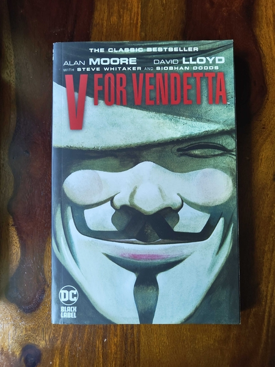

# Hello World!

I go by the pen name DVS, and I have taken up a hobby as of today, Apr 14 2025.  
It so happens that I'm at a point in life where I find that, some of my observations on life, are beyond what I can share with those whom I know.   
So I plan to use this space as a medium to have that dialogue, albeit internal, posted externally.

I'll start today with a quote from one of my favorite movie/book - V for Vendetta

**“Voilà! In view, a humble vaudevillian veteran cast vicariously as both victim and villain by the vicissitudes of fate.....**

## Why is this special to me?

The quote just sounds nice, if you've watched the movie, you'd agree that Hugo Weaving has done a brilliant job in its delivery. It's a brilliant aliteration with the letter V some of which I was new to when I first listened to it, I've probably rewatched the movie over 10 times since. I want to spend spend some time to share my understanding of it.

Vaudevill is/was an artform performed with masks, for those using the 🎭 in chats, this is where they come from.  The speaker is trying to show that this is an act, a performance of sorts and laments about his life/state, he says he's been wearing these masks for so long that he is a veteran at it. The use of humble I think is an internal joke in context of being thrown into this world as both victim and villain without choice. 

Think of it like this, as you are living your day to day life, you are forced into situations personally, professionaly, socially, politically.. to take a stand where sometimes you're a villain and sometimes you're the victim with little or no choice. Do you cry or do you laugh at it? At a point you get tired of it too.

Ending it here for today, will continue tomorrow.

-DVS

P.S. **.....This visage, no mere veneer of vanity, is a vestige of the vox populi, now vacant, vanished, as the once vital voice of the versimilitude now venerates what they once vilified. However, this valorous visitation of a by-gone vexation stands vivified and has vowed to vanquish these venal and virulent vermin vanguarding vice and vouchsafing the violently vicious and voracious violation of volition! 
The only verdict is vengeance; a vendetta held as a votive, not in vain, for the value and veracity of such shall one day vindicate the vigilant and the virtuous. Verily, this vichyssoise of verbiage veers most verbose vis-a-vis and introduction, so it's my very good honor to meet you.
And you may call me "V".**