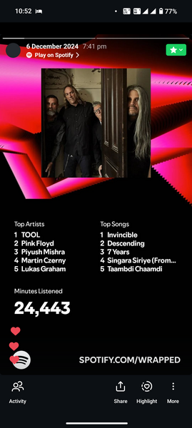

[Kaahe Chhed](https://open.spotify.com/track/7LgYx8FPuRvjSaFKw4ImIT?si=cee7936015b9444b) (Link redirects to Spotify to play song)

Today we'll listen to a song from the movie Devdas (2002), Kahe Chhed Mohe featuring vocals form [Kavita Krishnamurthy](https://en.wikipedia.org/wiki/Kavita_Krishnamurti), [Pandit Birju Maharaj](https://en.wikipedia.org/wiki/Birju_Maharaj) and [Madhuri Dixit](https://en.wikipedia.org/wiki/Madhuri_Dixit). For those unitiated to Indian Classical music or dance these names maybe unfamiliar, I've attached their wiki pages for info.

I have a habit of listening to music, extremely rarely do I watch the video accompanying it, it's also rare that I listen to the lyrics themselves, but I have a habit of listening to music. To show off what I mean by it, I'll share some excentricities on how far I'm obsessed with it.

Whenever I move I have a pair of earphones (**Soundcore V30i Open Ear**) in my pocket, which I use as I walk or am on my bike.  
I have a bone conduction earphones (**Aftershockz Open Move**) which I use at home.   
I carry a wireless noise cancellation headphones (**Bose QC45**) to office.  
I also carry a backup earphones (**Nothing Ear 1**) just in case, FYI this model actually has wireless charging, somehow this feature was never mentioned anywhere when it was released or later, getting this at ~4k INR was a steal when I purchased it, for context the current model Nothing Ear 2 with similar features with lower Quality Control goes for ~12k INR. 

For my bedroom I have a **iBall Booster 5.1 Bluetooth Speaker** This is an ancient relic, I think the company went bust, but from what I know, even if I sell it today, there are buyers who'll buy it for more than what I paid. Setting it up in the limited space I have with the best configuration required an old TV with an Optic Cable out, a simple Digital to Analogue coverter (DAC), and a smart TV connector like Roku or Amazon Firestick, to enable Spotify. Someday I do want to have a proper setup for listening to music, but for now this is my current rig.  

Last year according to Spotify I've listened to 24,443 minutes of music, i.e. an average of at least an hour daily. 

I have had the habit of listening to music since I was a kid, have a hobby of collecting music and making playlists. Sharing link to it, for those interested.
[Vishak's Selections](https://open.spotify.com/playlist/596c3Od1tJqx4mv645Z3No?si=c20361ecdccb4df6). Currently it has 1118 songs totalling a duration of 111hr 33min.

I was trained once upon a time during grades 1-10 in Carnatic Classical music and cleared the Junior exam in it. 

I was known to have always been seen wandering with earphones plugged in during my school/college days. Even the costliest pair of Philips wired earphones didn't last over 6 months (~3k in 2010). I have thrown on average a wired earphone every quarter for perhaps half a decade. You won't understand my fascination with these wireless audio devices I've mentioned earlier, and how they actually work, it's fascinating.

    This is a habit, and for those passionate to pick one, a word of advice, take care of your body first, quality over quantity.

P.S. I had recently shared a problem with my mentees and others at office. Give it a shot if it interests you.  
You listened to some new song and are very interested to share it with your neighbour sitting beside you. You want to listen to it alongside them and you don't want to pay for some service/device that provides such a feature like Spotify or disturb those sitting around you by using a speaker. What do you do? What are the drawbacks/limitations with your approach?

A solution I finally arrived at, that gets done in 3 lines of code. Took me half a day to get there, but I had some ideas from tinkering with audio and laptops since a long time to help.
Hint: Plumbing

Ciao.

-The Silent Librarian
