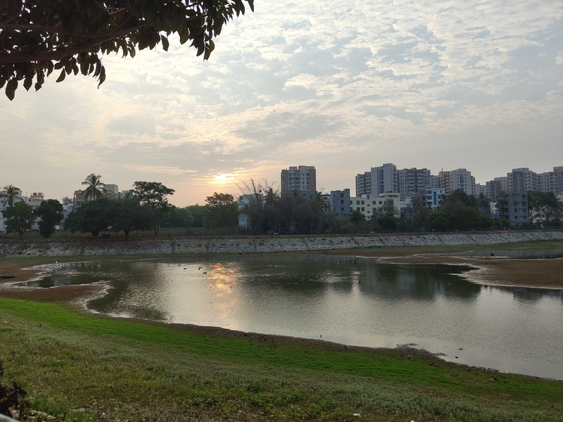

Today we'll listen to 3 pieces of music and try to grope in the dark a bit.

Ustad Sultan Khan, Ustad Zakir Hussain - [Raag Charukeshi](https://www.youtube.com/watch?v=yAEkb2cMDG4&t=1s) (Link redirects to Youtube to play song)  
TOOL - [Chocolate Chip Trip ](https://www.youtube.com/watch?v=POdNTtDi-eA)  
Veena Doreswamy Iyengar - [Raag Darbari Kanada Thillana](https://youtu.be/7XwnH5k4PBM?si=9LPeyMvQReI3ock-)

A photo taken during my early morning walk as I listened to some of these.

The first piece, by [Sultan Khan](https://en.wikipedia.org/wiki/Sultan_Khan_(musician)), is played on an instrument called [Sarangi](https://en.wikipedia.org/wiki/Sarangi). One of my favorite musical instruments, it is a rare, old and delicate one at that. I think it was like a great grandfather to modern day violin, travelling in the sands of the East, with a much deeper voice. Raag Charukeshi, another one of the those gems, I don't have words for the one who imagined it.  

You now take this Sarangi and the raag and put it in the hands of Ustads, not 1 but 2 of them, that, there is magic. Accompanying him is Ustad - [Zakir Hussain](https://en.wikipedia.org/wiki/Zakir_Hussain_(musician)), someone I think who doesn't need an introduction.  (from what I'm aware Ustad is a bestowed title, something not earned through training)

The second piece, by [TOOL](https://en.wikipedia.org/wiki/Tool_(band)) a band known for a genre of music called Progressive Rock/Metal (Prog-Rock) Usually the beats in western music is simple, this band is one of those that plays in polyrythmic tune. Check some of the videos by [Rick Beato](https://www.youtube.com/results?search_query=rick+beato+tool) to get some initiation about them. 

The third piece, by [Veena Doreswamy Iyengar](https://en.wikipedia.org/wiki/Doreswamy_Iyengar) is an evening raga called Darbari Kanada known for its majesty.

    What are they trying to grasp at? listen and try to answer for yourself, don't restrict to language as a medium of expression.

Listen to this [talk](https://www.youtube.com/watch?v=VYere8DxGbc) by Zakir Hussain, it's unclear to me whether he was even talking to  Tabla players in this.

-DVS  

P.S. I had a question in mind as I took my morning walk.   
If I were a fish in the lake surrounded by birds, suffocating slowly as the summer heat rose. Which of these three pieces would I relate to?

P.P.S. Have you heard of [Bouba Kiki effect?](https://www.youtube.com/watch?v=1TDIAObsqcs)