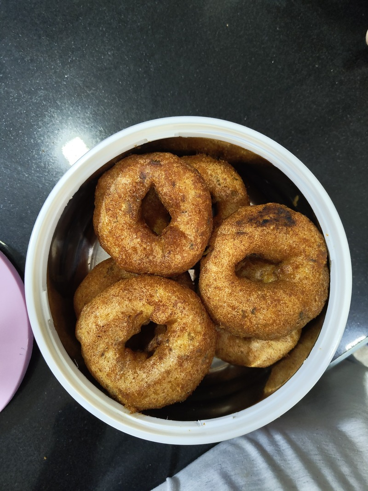

Let's taste some maddur vada today, but unfortunaterly mom has given a small slat circular box case, so how do I fit all 6 in them?
Take three at a time and make a triangle of them and stack one more on top for it. Like a flower.  

  

Supposedly a proof about why this is the best arrangement goes back to stacking cannonballs, Honey combs, plant cell walls etc., 

Watch this [veritiasium video](https://www.youtube.com/watch?v=48sCx-wBs34) that goes into this in much more depth

The main idea which works here is irrationality. The [golden ratio](https://en.wikipedia.org/wiki/Golden_ratio) given by the solution for x in the equation x - 1/x =1.  

Irrationality has interesting properties, and so does the golden ratio, also one of the transcendental irrational numbers. It is supposedly the most irrational of all irractional numbers. (Yes, there's a way to measure how crazy numbers are) And what it means to us who observe it all around us for example in A4 size paper sheets, snail shells, Stradivarius violins, human body, sunflower spirals, branching of leaves etc.,

I'll try to give a simple explanation using branching of leaves as an example. Suppose you're a leaf trying to capture the maximum amount of light possible and you were constatined with the condition that there will be other leaves as you grow. How would you optimze for it, the answer leads you to the golden ratio. viz-a-viz by being as away as possible from the prvious leaves in a constrained fashion you'd not only capture maximum sunlight but also allow the plant as a whole capture maximum sunlight.

-TSL