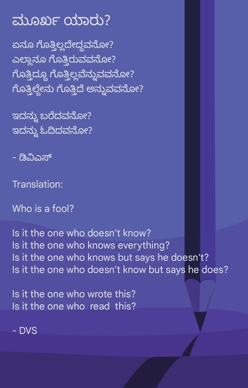

# Hello World!

I choose the pen name The Silent Librarian for the hobby I have taken up as of Apr 14 2025.  
It so happens that I'm at a point in life where I find that, some of my observations on life, are beyond what I can share with those whom I know.   
So I plan to use this space as a medium to have that dialogue, albeit internal, posted externally.  
[Click to start reading](https://vishaksagar.github.io/DVS/#path=2025%2FApril)

### Names I go/have gone by
**Vishak Sagar** (given by parents)
The name Vishak (also sometimes spelled Vishakh or Visakh) has its roots in Sanskrit and is used in India. Here's a breakdown of the meaning:

1. Sanskrit origin:
Vishak is often associated with "visakha", which is the name of a nakshatra (lunar mansion) in Indian astrology—Vishakha Nakshatra. It is one of the 27 divisions of the sky that the moon passes through.

2. Meaning: Vishakha means "branched" or "forked", symbolizing growth, branching paths, or multiple directions. It's also interpreted as "radiant" or "bright" in some contexts.

3. Mythological link:
Vishakha is also a name sometimes associated with a goddess or celestial being, and in Buddhist tradition, Visakha was a prominent female lay disciple of Gautama Buddha.

Credits: ChatGPT

##  
I used to use the interpretation as radiant as in the sun and Sagar as in ocean and the joke went as follows:  
**You take a radiator and put it in the ocean you get steam, the steam is like a Sauna therefore I'll be your Shona (lover)**

Vishak Sagar can be jumbled and written as **Vig Rakshasa**
If you were Bengali you'd pronounce it as Big

College nickname by batchmates was **Anna** (elder brother), by one guy there it was Vishak ke papa  

During school it was like shaki or whiskey  

Wife and family have kept nicknames but those are secret😅

My pen name for writing poetry is **DVS** [Wordpress](https://dvsvishak.wordpress.com/). The blank piece of paper with an infinity pencil is taken from it. Multiple people asked what does DVS mean? So here's what it has been, so far
- DVS sounds like devious/devilish   
- D is a dream  
- I do want to have a PhD/DSc tag with my name someday
- [One Piece](https://en.wikipedia.org/wiki/One_Piece) manga/anime has a thing called Will of D. which is a secret kept from the readers since it's inception 20+ years ago, and FYI it's ongoing with over 1000 chapters and episodes
- Digitally Verified Shooter (A friend said this after I shared these posts with him)
P.S. The wordpress site is a bit dated. I haven't updated it in a while.
Here's something I wrote recently.  
